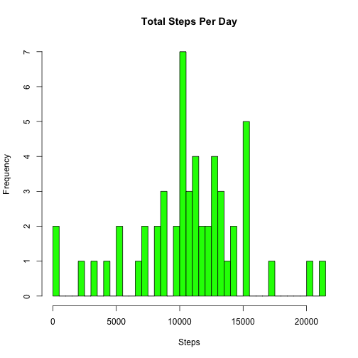
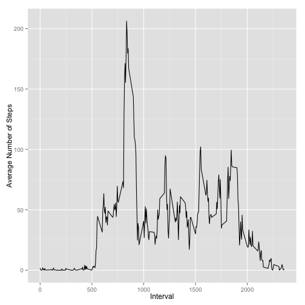
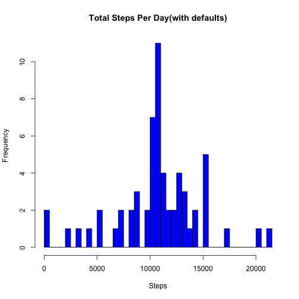

# Reproducible Research: Peer Assessment 1


## Loading and preprocessing the data
Load the ggplot2 package, because we will be using this to produce some of the plots.
Read the data in, and then use "complete.cases" to eliminate the rows with "NA" data.


```r
library("ggplot2")
act_dat <- read.csv("activity.csv", header = TRUE, na.strings = "NA", colClasses = c("integer", 
    "Date", "integer"))
act_dat_na_removed <- act_dat[complete.cases(act_dat), ]
```


Verify this by counting the rows in the original data, and the cleaned data.


```r
nrow(act_dat)
```

```
## [1] 17568
```

```r
nrow(act_dat_na_removed)
```

```
## [1] 15264
```


Use the "aggregate" with "FUN=sum", to calculate the total number of steps by date.

Generate a histogram showing range of steps split into 40 breaks, against the number of 
days for which that number of steps was recorded.


```r
total_steps_day <- aggregate(steps ~ date, data = act_dat_na_removed, FUN = sum)

hist(total_steps_day$steps, breaks = 40, col = "green", main = "Total Steps Per Day", 
    xlab = "Steps")
```

 


## What is mean total number of steps taken per day?

Obtain the mean and median of the total steps per day.


```r
mean(total_steps_day$steps)
```

```
## [1] 10766
```

```r
median(total_steps_day$steps)
```

```
## [1] 10765
```


## What is the average daily activity pattern?

Use the "aggregate" function again, this time with "FUN=mean" in order to calculate
the mean number of steps by interval.

Use "max" to find the interval with the highest mean number of steps, then plug
that into the data frame reference to determine the time period that had the 
highest mean value.


```r
steps_per_interval <- aggregate(steps ~ interval, data = act_dat_na_removed, 
    FUN = mean)
max(steps_per_interval$steps)
```

```
## [1] 206.2
```

```r
steps_per_interval[steps_per_interval$steps > 206, ]
```

```
##     interval steps
## 104      835 206.2
```


Use ggplot to plot the average number of steps taken at each interval.


```r
ggplot(steps_per_interval, aes(x = interval, y = steps)) + geom_line() + xlab("Interval") + 
    ylab("Average Number of Steps")
```

 


## Imputing missing values

Create a function called "lookup_avg" that uses the previously generated mean number
of steps per interval as a lookup, which returns the mean number of steps for the 
interval supplied as a parameter.


```r

lookup_avg <- function(p_interval) {
    x <- steps_per_interval[steps_per_interval$interval == p_interval, ]
    return(x$steps)
}
```


Create a function called "set_defaults", which processes the original data frame, row by row.
For each row, if the number of steps is NA, then use lookup_avg passing in the interval for
the current row. Create a new row with the average value returned by lookup_avg, and the original date and interval value, and add it to the new data frame.. If the original row has a value for the number of steps, do nothing except generate a new row from the original values, and add it to the new data frame. At the end of the function we should have a new data frame where the number of steps that were NA have been replaced with the average for the associated 
interval.

This isn't terribly efficient, but it works, and I couldn't get any of the apply family
to work. Any ideas of a more efficient way would be very welcome.


```r
set_defaults <- function() {
    for (i in 1:nrow(act_dat2)) {
        row <- act_dat2[i, ]
        
        if (is.na(row[1])) {
            l_steps <- lookup_avg(as.numeric(row[3]))
        } else {
            l_steps = as.numeric(row[1])
        }
        
        if (i == 1) {
            act_data_w_defaults <- data.frame(steps = c(l_steps), date = c(row[2]), 
                interval = c(as.numeric(row[3])))
        } else {
            tmpdf <- data.frame(steps = c(l_steps), date = c(row[2]), interval = c(as.numeric(row[3])))
            act_data_w_defaults <- rbind(act_data_w_defaults, tmpdf)
        }
    }
    return(act_data_w_defaults)
}
```


Take a copy of the original data frame. Run the function to set defult values, and 
compare the initial rows to verify that the substitution has taken place.


```r
act_dat2 <- act_dat

act_dat2 <- set_defaults()

head(act_dat)
```

```
##   steps       date interval
## 1    NA 2012-10-01        0
## 2    NA 2012-10-01        5
## 3    NA 2012-10-01       10
## 4    NA 2012-10-01       15
## 5    NA 2012-10-01       20
## 6    NA 2012-10-01       25
```

```r
head(act_dat2)
```

```
##     steps       date interval
## 1 1.71698 2012-10-01        0
## 2 0.33962 2012-10-01        5
## 3 0.13208 2012-10-01       10
## 4 0.15094 2012-10-01       15
## 5 0.07547 2012-10-01       20
## 6 2.09434 2012-10-01       25
```


Redo our earlier calculations with the data frame containing the default data replacing the
the NA values, then redraw the histogram.


```r
total_steps_day <- aggregate(steps ~ date, data = act_dat2, FUN = sum)

hist(total_steps_day$steps, breaks = 40, col = "blue", main = "Total Steps Per Day(with defaults)", 
    xlab = "Steps")
```

 


Determine the new mean and median values.


```r
mean(total_steps_day$steps)
```

```
## [1] 10766
```

```r
median(total_steps_day$steps)
```

```
## [1] 10766
```


Because we used the average values for the intervals, to replace the NAs, we can see that the mean and median values are almost identical to the values achieved without the inclusion of the 
rows with NA values.

## Are there differences in activity patterns between weekdays and weekends?
